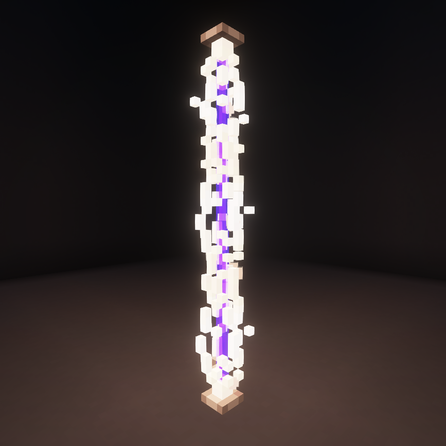
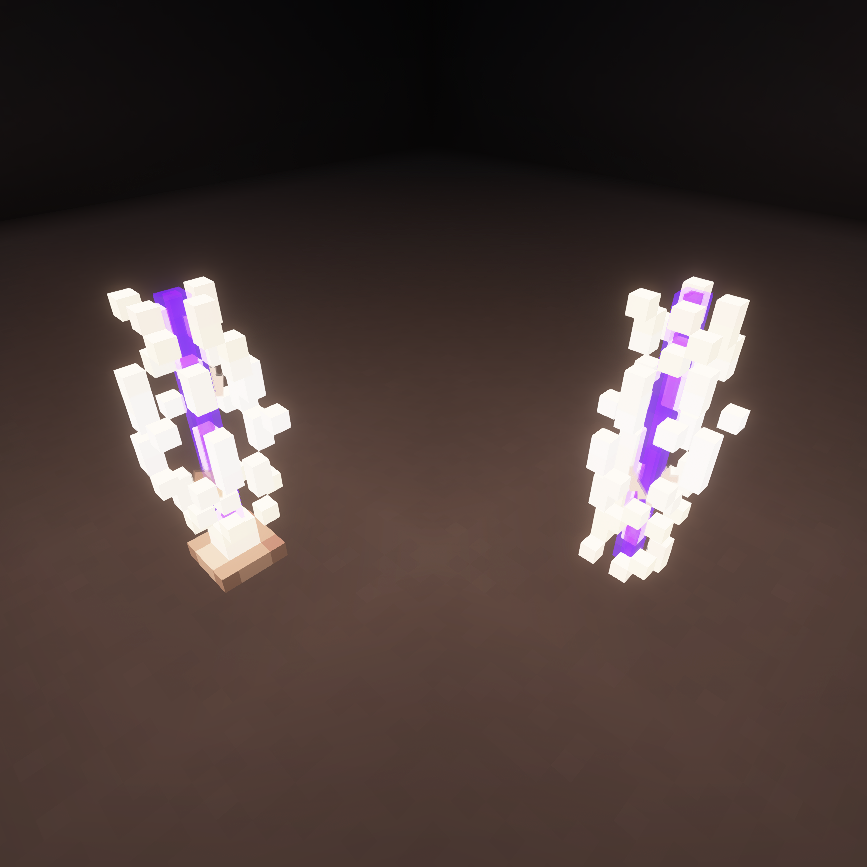
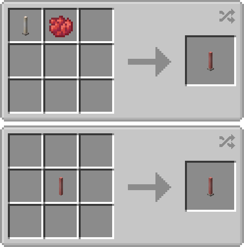
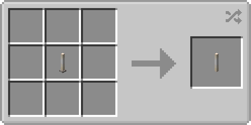
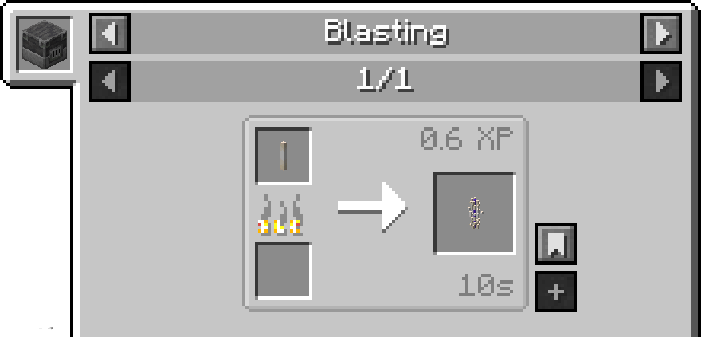
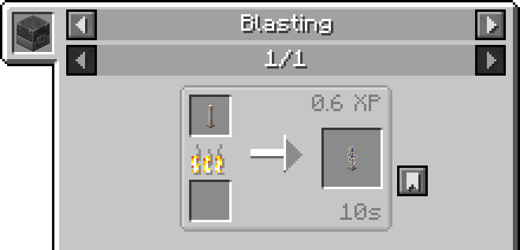

# Improved End Rods

A Minecraft mod for **NeoForge 1.21.1** that adds more visual variety and
building options using end rods. This mod introduces **colored end rods** in 15 vanilla dye colors (excluding white),
**endless end rods** with no base, and **broken end rods** — cracked and shattered variants for a more worn aesthetic.

---

## ✨ Features

- 🎨 **Colored End Rods**  
  15 dye colors supported. Add some vibrant flair to your builds!

- 🌀 **Endless End Rods**  
  A minimalist visual variant of the vanilla end rod.  
  No base — just a clean vertical stick of light.

- 🔮 **Broken End Rods**  
  A shattered version of the end rod and endless end rod.

- 🔥 **Built for NeoForge 1.21.1**

---

## 🖼️ Screenshots

### Without Shaders

### With Shaders (Complementary Shaders + PBR Resource Pack)

### End Rod vs Endless End Rod

### Broken End Rod & Broken Endless End Rod

---

## 🛠️ Installation

1. Install [NeoForge](https://neoforged.net/) for Minecraft 1.21.1.
2. Download the latest release from the [Releases](https://github.com/The-UnCursed/NeoForge-Improved-End-Rods-1.21.1/releases) page.
3. Place the `.jar` file in your Minecraft `mods/` folder.
4. Launch the game and enjoy improved lighting variety!

---

## 📦 Crafting

- ## **Colored End Rods**:  
  

- ## **Endless End Rods**:  
  

- ## **Broken End Rods**:
  
  
  ### *Broken end rods can be repaired with chorus fruit.*

---

## 🧑‍💻 Credits

Developed by [The-UnCursed](https://github.com/The-UnCursed)

---

## 📜 License

This mod is open source under the MIT License. See the [LICENSE](./LICENSE) file for details.
